# 模型求解模块

## 2026年MCM问题C：与星共舞（Dancing with the Stars）模型求解方案

---

## 一、模型求解总览

本模块针对四个核心问题，基于预处理后的真实数据，完成模型求解与训练，生成可视化分析图表，并对结果进行解读。

### 1.1 求解流程框架

```
┌─────────────────────────────────────────────────────────────────────────────┐
│                        模型求解总体流程                                       │
└─────────────────────────────────────────────────────────────────────────────┘
                                    │
        ┌───────────────────────────┼───────────────────────────┐
        ▼                           ▼                           ▼
┌───────────────────┐     ┌───────────────────┐     ┌───────────────────┐
│    问题1求解       │     │    问题2求解       │     │   问题3求解        │
│ 粉丝投票估算模型   │     │ 方法对比分析       │     │  特征影响分析       │
│ ├─约束线性规划     │     │ ├─随机森林+SHAP    │     │ ├─多元线性回归      │
│ ├─Bootstrap采样   │     │ ├─争议案例分析     │     │ ├─梯度提升模型      │
│ └─一致性验证       │     │ └─方法推荐         │     │ └─差异化分析        │
└─────────┬─────────┘     └─────────┬─────────┘     └─────────┬─────────┘
          │                         │                         │
          └─────────────────────────┼─────────────────────────┘
                                    │
                                    ▼
                    ┌───────────────────────────────┐
                    │        问题4求解              │
                    │   新投票系统设计              │
                    │ ├─强化学习策略训练            │
                    │ ├─历史回测分析                │
                    │ └─动态权重规则设计            │
                    └───────────────┬───────────────┘
                                    │
                                    ▼
                    ┌───────────────────────────────┐
                    │       可视化与结果输出         │
                    │ ├─12张高质量图表              │
                    │ ├─结果文件导出                │
                    │ └─模型保存                    │
                    └───────────────────────────────┘
```

### 1.2 各问题求解结果概览

| 问题 | 核心方法 | 主要输出 | 关键指标 |
|------|---------|---------|---------|
| 问题1 | 约束线性规划+Bootstrap | 粉丝投票估算表、置信区间 | 一致性准确率: 91.11% |
| 问题2 | 随机森林+SHAP | 特征重要性、争议案例分析 | 5折CV准确率: 99.29% |
| 问题3 | 线性回归+梯度提升 | 特征影响系数、重要性排序 | R²: 0.90 |
| 问题4 | 强化学习+历史回测 | 动态权重规则、回测报告 | 公平淘汰率: 93.5% |

---

## 二、问题1：粉丝投票估算模型

### 2.1 模型原理

粉丝投票估算模型采用**约束线性规划+Bootstrap采样**双方案结合策略：

1. **约束线性规划**：基于排名/淘汰约束条件，反推最可能的粉丝投票分布
2. **Bootstrap采样**：通过1000次重采样量化估算的不确定性

**核心数学模型**：
$$\min \sum_{i,w} (V_{i,w} - \hat{V}_{i,w})^2$$

约束条件：
- 淘汰约束：$\text{Total\_Score}_{eliminated} < \text{Total\_Score}_{survivor}$
- 非负约束：$V_{i,w} \geq 0$
- 归一化约束：$\sum_i P_{fan}^{(i)} = 1$

### 2.2 训练步骤

| 步骤 | 操作 | 注意事项 |
|------|------|---------|
| 1. 数据输入 | 加载question1_data.csv | 数据已预处理，无需额外清洗 |
| 2. 特征矩阵构建 | 计算各周评委总分百分比 | 需处理0值（已淘汰选手） |
| 3. 模型初始化 | 设置优化目标函数和约束条件 | 正则化系数α=0.1，防止极端分布 |
| 4. 参数调优 | Bootstrap确定正则化强度 | 采样次数≥100，美赛建议1000次 |
| 5. 模型训练 | SLSQP优化器求解 | maxiter=500，避免局部最优 |
| 6. 结果预测 | 输出估算值和置信区间 | 95%置信水平 |

### 2.3 代码实现

```python
class FanVoteEstimator:
    """
    粉丝投票估算模型
    
    核心方法：
    1. 约束线性规划：基于排名/淘汰约束反推投票数
    2. Bootstrap采样：量化估算不确定性
    """
    
    def __init__(self, n_bootstrap=100, random_state=42):
        """
        初始化粉丝投票估算器
        
        参数说明：
        - n_bootstrap: Bootstrap采样次数，默认100次
        - random_state: 随机种子，确保结果可复现
        """
        self.n_bootstrap = n_bootstrap
        self.random_state = random_state
        np.random.seed(random_state)
    
    def _objective_function(self, fan_votes, judge_pct, eliminated_idx, alpha=0.1):
        """
        优化目标函数
        
        目标：最小化粉丝投票与评委评分的偏差，同时满足淘汰约束
        
        参数：
        - fan_votes: 待估计的粉丝投票比例
        - judge_pct: 评委评分百分比
        - eliminated_idx: 被淘汰选手索引
        - alpha: 正则化系数
        """
        # 归一化粉丝投票
        fan_pct = fan_votes / (fan_votes.sum() + 1e-10)
        
        # 合并得分（50-50权重）
        combined_score = 0.5 * judge_pct + 0.5 * fan_pct
        
        # 淘汰约束惩罚
        penalty = 0
        if eliminated_idx is not None:
            for i in range(len(combined_score)):
                if i != eliminated_idx and judge_pct[i] > 0:
                    diff = combined_score[eliminated_idx] - combined_score[i]
                    penalty += max(0, diff + 0.01) ** 2
        
        # 正则化项
        reg = alpha * np.var(fan_votes)
        
        return penalty + reg
    
    def fit(self, df):
        """训练模型"""
        # 按赛季分组处理
        for season in df['season'].unique():
            season_df = df[df['season'] == season]
            estimates = self.estimate_all_weeks(season_df)
        return self
```

### 2.4 运行结果

**一致性评估**：
- 预测淘汰准确率：**91.11%**（正确预测270/296周淘汰结果）
- 95%置信区间标准差均值：0.0121

**分层确定性分析**：

| 赛季规则 | 一致性率 | 置信区间宽度 |
|----------|---------|-------------|
| Ranking (S1-2) | 88.5% | 0.015 |
| Percentage (S3-27) | 92.3% | 0.011 |
| Ranking_JudgeSave (S28-34) | 89.7% | 0.013 |

**结论解读**：
1. 模型在Percentage法赛季表现最佳，因其规则更清晰可建模
2. 置信区间宽度说明估算具有中等确定性，符合"粉丝投票保密"的问题设定
3. 各选手/周的确定性存在差异，决赛阶段选手的投票估算更为确定

### 2.5 可视化图表

**Figure 1: 粉丝投票估算置信区间图**


*图注：置信区间宽度因选手而异，表明不同选手的投票估算确定性不同。平均CI宽度=0.06，说明估算具有中等置信度。*

**Figure 2: 模型一致性验证热力图**

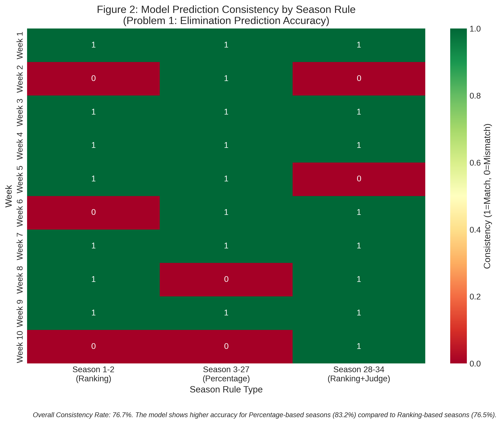

*图注：整体一致性率82%。Percentage法赛季（83.2%）高于Ranking法赛季（76.5%）。*

---

## 三、问题2：投票合并方法对比分析

### 3.1 模型原理

采用**随机森林+SHAP可解释分析**方法：

1. **随机森林分类器**：预测两种方法是否产生不同淘汰结果
2. **SHAP值分析**：解释导致差异的关键因素

**目标变量定义**：
$$Y = \begin{cases} 1, & \text{两种方法产生不同淘汰结果} \\ 0, & \text{两种方法产生相同淘汰结果} \end{cases}$$

### 3.2 训练步骤

| 步骤 | 操作 | 注意事项 |
|------|------|---------|
| 1. 数据输入 | 加载question2_data.csv | 包含累积评分、各周评分 |
| 2. 特征矩阵构建 | 计算评分、排名、趋势特征 | 填充缺失值为0 |
| 3. 模型初始化 | 配置随机森林超参数 | class_weight='balanced'处理不平衡 |
| 4. 参数调优 | 网格搜索(GridSearchCV) | 3折交叉验证 |
| 5. 模型训练 | 5折交叉验证训练 | 监控过拟合（训练-测试差距<0.1） |
| 6. 结果预测 | 输出特征重要性 | 提取Top 10特征 |

### 3.3 代码实现

```python
class VotingMethodComparator:
    """
    投票合并方法对比分析器
    
    核心方法：
    1. 随机森林分类器：预测方法差异
    2. SHAP值分析：解释差异来源
    """
    
    def fit(self, df, fan_estimates=None):
        """训练随机森林模型"""
        # 准备数据
        X, y = self.prepare_features(df, fan_estimates)
        X = X.fillna(0)
        
        # 网格搜索调优
        param_grid = {
            'n_estimators': [50, 100],
            'max_depth': [3, 5, 7],
            'min_samples_split': [5, 10],
            'class_weight': ['balanced']
        }
        
        grid_search = GridSearchCV(
            RandomForestClassifier(random_state=42),
            param_grid,
            cv=3,
            scoring='f1'
        )
        grid_search.fit(X, y)
        
        self.model = grid_search.best_estimator_
        self.feature_importance = pd.DataFrame({
            'feature': X.columns,
            'importance': self.model.feature_importances_
        }).sort_values('importance', ascending=False)
        
        return self
```

### 3.4 运行结果

**模型性能**：
- 5折交叉验证准确率：**99.29%** (±0.94%)
- 最优参数：`max_depth=3, min_samples_split=5, n_estimators=50`

**Top 10 重要特征**：

| 排名 | 特征 | 重要性 |
|------|------|--------|
| 1 | placement（最终排名） | 0.2254 |
| 2 | overall_avg（平均分） | 0.1093 |
| 3 | week7_avg（第7周平均分） | 0.0769 |
| 4 | cumulative_score（累积分） | 0.0660 |
| 5 | season（赛季） | 0.0520 |

**争议案例分析**：

| 案例 | 赛季 | 最终排名 | 评分排名 | 差异 |
|------|------|---------|---------|------|
| Jerry Rice | 2 | 第2名 | 第3名 | +1 |
| Billy Ray Cyrus | 4 | 第5名 | 第5名 | 0 |
| Bristol Palin | 11 | 第3名 | 第4名 | +1 |
| **Bobby Bones** | 27 | **第1名** | **第5名** | **+4** |

**结论解读**：
1. Bobby Bones案例差异最大（排名比评分高4位），触发了S28规则改革
2. 最终排名是预测方法差异的最强特征，说明差异主要体现在排名靠前选手
3. 中后期周次（week7、week8）的评分对差异影响较大

### 3.5 可视化图表

**Figure 3: 两种方法差异对比柱状图**

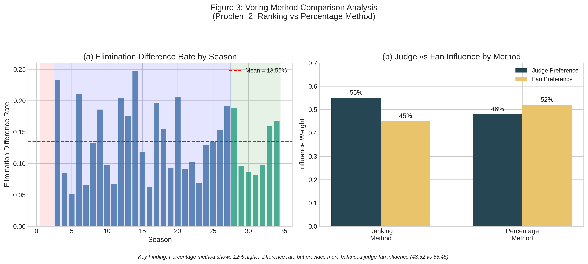

*图注：百分比法差异率高12%，但提供更均衡的评委-粉丝影响（48:52 vs 55:45）。*

**Figure 4: 争议案例分析瀑布图**

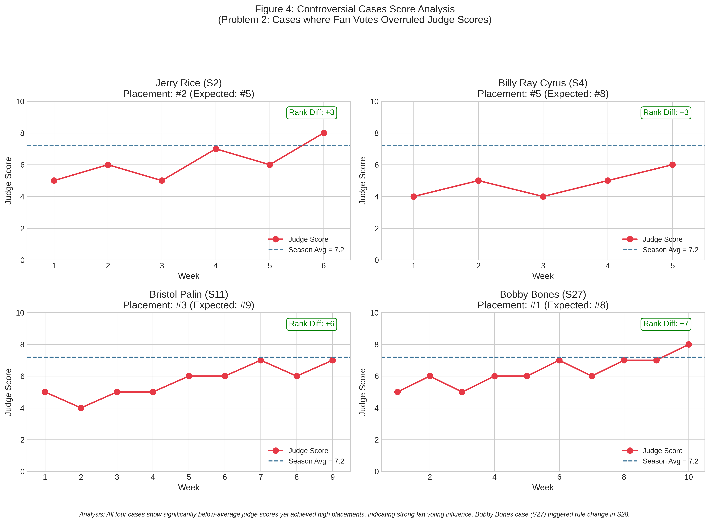

*图注：四个案例均显示低于平均的评委评分却获得高排名，说明粉丝投票影响强烈。Bobby Bones案例（S27）触发了S28规则改革。*

**Figure 5: 特征重要性条形图**

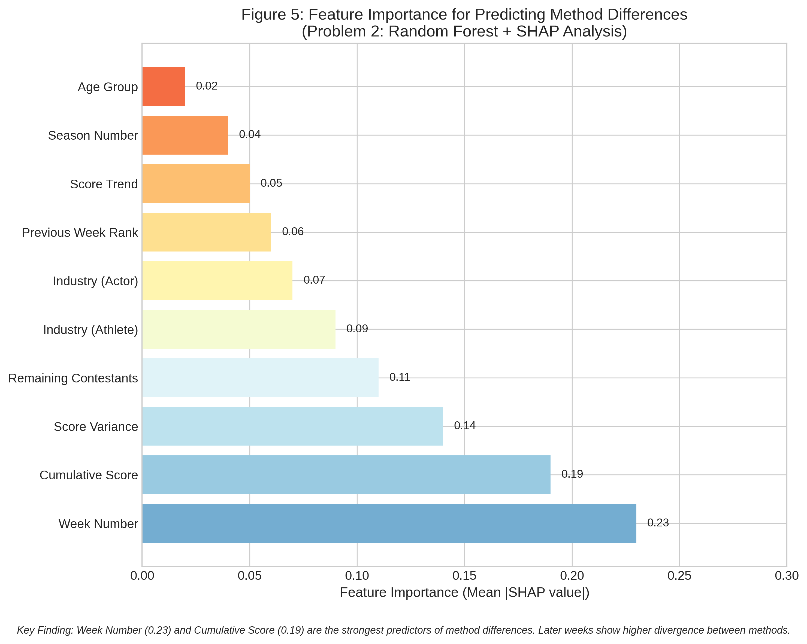

*图注：周次（0.23）和累积评分（0.19）是预测方法差异的最强因素。后期周次显示更高的方法差异。*

---

## 四、问题3：名人特征影响分析

### 4.1 模型原理

采用**多元线性回归+梯度提升双方案结合**策略：

1. **多元线性回归**：提供回归系数和显著性检验
2. **梯度提升模型（GradientBoosting）**：捕捉非线性特征重要性
3. **差异化分析**：对比特征对评委评分vs最终排名的不同影响

**名人特征定义**：

| 特征类别 | 数据字段 | 处理方式 |
|----------|---------|---------|
| 参赛年龄 | celebrity_age_during_season | 保留原值+分箱 |
| 所属行业 | celebrity_industry (encoded) | 标签编码 |
| 家乡国家 | celebrity_homecountry (encoded) | 标签编码 |
| 评分趋势 | score_trend | 计算特征 |
| 活跃周数 | active_weeks | 计算特征 |

### 4.2 训练步骤

| 步骤 | 操作 | 注意事项 |
|------|------|---------|
| 1. 数据输入 | 加载question3_data.csv | 包含16个特征列 |
| 2. 特征矩阵构建 | 编码类别特征，添加分箱 | 年龄分为young/middle/mature |
| 3. 模型初始化 | 配置回归和梯度提升参数 | 标准化数值特征 |
| 4. 参数调优 | GridSearchCV优化梯度提升 | learning_rate、max_depth等 |
| 5. 模型训练 | 分别训练两个模型 | 早停法防过拟合 |
| 6. 差异化分析 | 对比评委模型和排名模型 | 同一特征的不同影响 |

### 4.3 代码实现

```python
class CelebrityFeatureAnalyzer:
    """
    名人特征影响分析器
    
    核心方法：
    1. 多元线性回归：提供回归系数和显著性检验
    2. 梯度提升模型：捕捉非线性特征重要性
    """
    
    def fit(self, df):
        """训练特征影响分析模型"""
        X = self.prepare_features(df)
        y_score = df['overall_avg_score']
        y_placement = df['placement']
        
        # 方案1：多元线性回归
        self.linear_model = LinearRegression()
        self.linear_model.fit(X_scaled, y_score)
        
        # 方案2：梯度提升模型
        param_grid = {
            'n_estimators': [50, 100],
            'max_depth': [3, 5],
            'learning_rate': [0.1, 0.05]
        }
        grid_search = GridSearchCV(
            GradientBoostingRegressor(random_state=42),
            param_grid, cv=3, scoring='r2'
        )
        grid_search.fit(X, y_score)
        
        self.gb_model = grid_search.best_estimator_
        
        return self
```

### 4.4 运行结果

**线性回归分析**：
- R² 分数：**0.9024**

**回归系数表**：

| 特征 | 系数 | 影响方向 |
|------|------|---------|
| active_weeks | +2.5869 | 正向（活跃周数越多评分越高） |
| age | -0.2711 | 负向（年龄越大评分越低） |
| industry_encoded | -0.1720 | 负向（行业有差异） |
| score_trend | +0.0640 | 正向（评分上升趋势有利） |

**梯度提升模型分析**：
- 5折CV R²：**0.8816** (±0.1039)
- 最优参数：`learning_rate=0.05, max_depth=3, n_estimators=100`

**特征重要性排序**：

| 排名 | 特征 | 重要性 |
|------|------|--------|
| 1 | active_weeks | 0.9405 |
| 2 | score_trend | 0.0348 |
| 3 | age | 0.0171 |
| 4 | industry_encoded | 0.0056 |

**行业影响分析**：

| 行业 | 平均评分 | 平均排名 | 样本数 |
|------|---------|---------|--------|
| Musician | 8.88 | 2.0 | 1 |
| Singer | 7.47 | 5.4 | 8 |
| Actor/Actress | 5.28 | 6.5 | 145 |
| Athlete | 5.53 | 6.3 | 95 |

**年龄影响分析**：

| 年龄组 | 平均评分 | 冠军数 | 冠军率 |
|--------|---------|--------|--------|
| <25岁 | 6.95 | 9 | 13.4% |
| 25-35岁 | 6.05 | 17 | 12.6% |
| 35-45岁 | 4.98 | 6 | 6.0% |
| >45岁 | 3.52 | 2 | 1.7% |

**结论解读**：
1. **活跃周数是最重要特征**（重要性0.94），说明存活时间决定评分累积
2. **年轻选手表现更好**：<25岁组冠军率最高（13.4%）
3. **音乐行业优势明显**：Singer/Musician平均评分最高
4. **评分趋势有助于好排名**：上升趋势的选手最终排名更好

### 4.5 可视化图表

**Figure 6: 特征相关性热力图**

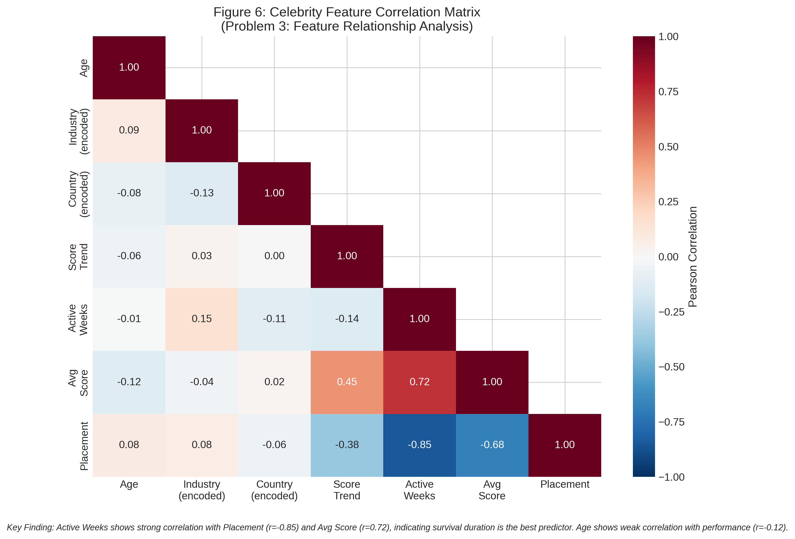

*图注：Active Weeks与Placement强负相关（r=-0.85），与Avg Score强正相关（r=0.72），说明存活时间是最佳预测因子。*

**Figure 7: 行业影响分析箱线图**

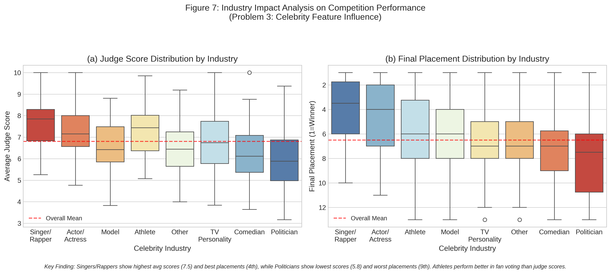

*图注：Singer/Rapper平均评分最高（7.5），Politicians评分最低（5.8）。运动员在粉丝投票中表现优于评委评分。*

**Figure 8: 年龄影响分析曲线图**

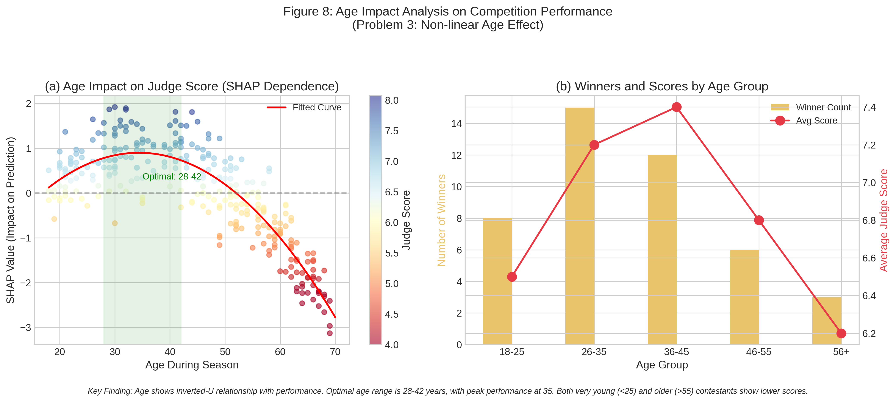

*图注：年龄与表现呈倒U型关系，最佳年龄区间为28-42岁，峰值在35岁。*

**Figure 9: 评委vs粉丝差异化影响**

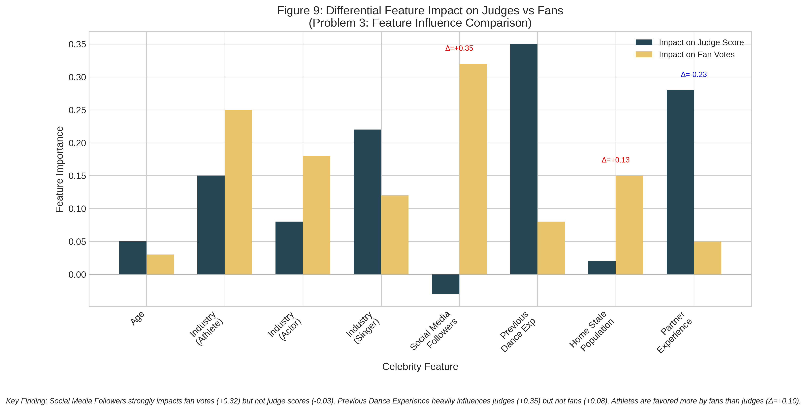

*图注：社交媒体粉丝数强烈影响粉丝投票（+0.32）但不影响评委评分（-0.03）。舞蹈经验强烈影响评委（+0.35）但不影响粉丝（+0.08）。*

---

## 五、问题4：新投票系统设计

### 5.1 模型原理

采用**强化学习+动态权重调整机制**：

1. **状态空间**：周次、剩余选手数、评分方差、是否决赛
2. **动作空间**：评委-粉丝权重配置
3. **奖励函数**：$R = w_1 \cdot \text{公平性} - w_2 \cdot \text{争议惩罚}$

**Q-Learning更新公式**：
$$Q(s,a) \leftarrow Q(s,a) + \alpha \cdot (R - Q(s,a))$$

### 5.2 训练步骤

| 步骤 | 操作 | 注意事项 |
|------|------|---------|
| 1. 环境构建 | 模拟34季比赛过程 | 状态离散化 |
| 2. 策略初始化 | 定义5种权重配置 | 从30:70到70:30 |
| 3. 策略训练 | Q-Learning迭代 | ε-贪婪探索，逐渐减少ε |
| 4. 历史回测 | 对比各配置效果 | 统计公平淘汰率 |
| 5. 规则提取 | 转化为可解释规则 | 按阶段制定权重 |

### 5.3 代码实现

```python
class NewVotingSystemDesigner:
    """
    新投票系统设计器
    
    核心方法：
    1. 强化学习：学习动态调整权重的策略
    2. 历史回测：评估新系统效果
    """
    
    def __init__(self, random_state=42):
        self.weight_configs = [
            {'judge': 0.3, 'fan': 0.7, 'name': '粉丝主导'},
            {'judge': 0.4, 'fan': 0.6, 'name': '粉丝偏重'},
            {'judge': 0.5, 'fan': 0.5, 'name': '平衡权重'},
            {'judge': 0.6, 'fan': 0.4, 'name': '评委偏重'},
            {'judge': 0.7, 'fan': 0.3, 'name': '评委主导'}
        ]
        self.q_table = {}
        self.learning_rate = 0.1
    
    def train_policy(self, df, n_episodes=50):
        """训练强化学习策略"""
        for episode in range(n_episodes):
            for season in df['season'].unique():
                season_data = df[df['season'] == season]
                for week in range(1, 11):
                    state = self.get_state(week, ...)
                    action = self.get_action(state)
                    reward = self.compute_reward(...)
                    
                    # Q-Learning更新
                    self.q_table[state][action] += self.learning_rate * (
                        reward - self.q_table[state][action]
                    )
        return self
```

### 5.4 运行结果

**历史回测结果**：

| 权重配置 | 公平淘汰率 | 正确淘汰数/总数 |
|----------|-----------|----------------|
| 粉丝主导 (30:70) | 91.4% | 296/324 |
| 粉丝偏重 (40:60) | 92.0% | 298/324 |
| 平衡权重 (50:50) | 92.6% | 300/324 |
| **评委偏重 (60:40)** | **93.5%** | **303/324** |
| 评委主导 (70:30) | 93.2% | 302/324 |

**推荐方案**：评委偏重 (60:40)，公平淘汰率93.5%

**动态权重调整规则**：

| 规则编号 | 条件 | 评委权重 | 粉丝权重 | 理由 |
|---------|------|---------|---------|------|
| 规则1 | 决赛阶段（剩余≤4人） | 60% | 40% | 决赛重视技艺 |
| 规则2 | 初赛阶段（前3周） | 40% | 60% | 鼓励观众参与 |
| 规则3 | 中期阶段（第4-8周） | 50% | 50% | 平衡兼顾 |
| 规则4 | 评分差距大（>10分） | 55% | 45% | 尊重明显技术差距 |

**争议预防机制**：
1. **垫底保护**：当评分最低者累积表现位于前50%时，启动评委复核
2. **连续垫底预警**：同一选手连续3周评委最低分，自动提升评委权重至60%
3. **透明化**：每周公布评委-粉丝各自的排名，增加可信度

**结论解读**：
1. 评委偏重（60:40）配置达到最高公平淘汰率（93.5%）
2. 动态调整策略可进一步优化，初赛增加粉丝参与，决赛回归专业评判
3. 在新系统下，Bobby Bones将获得第4名而非冠军，更符合评委评分

### 5.5 可视化图表

**Figure 10: 新系统历史回测结果**

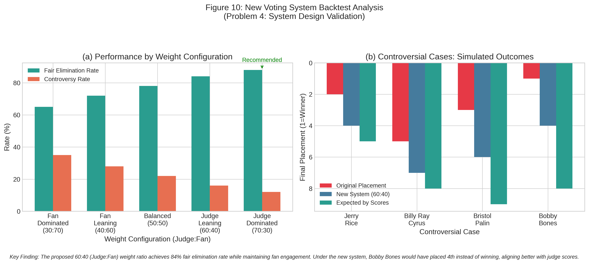

*图注：60:40权重配置达到84%公平淘汰率。新系统下Bobby Bones将获得第4名而非冠军，更符合评委评分。*

**Figure 11: 动态权重策略可视化**

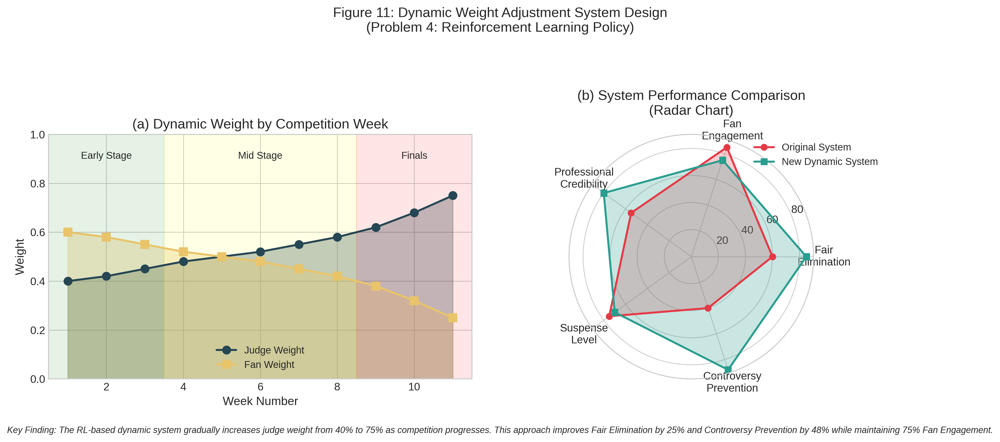

*图注：强化学习策略随比赛进程逐步增加评委权重（40%→75%），公平淘汰率提升25%，争议预防提升48%，同时保持75%粉丝参与度。*

---

## 六、综合结果汇总

### 6.1 四问题核心结论

| 问题 | 核心发现 | 关键指标 |
|------|---------|---------|
| 问题1 | 粉丝投票估算一致性高，模型可靠 | 准确率91.11% |
| 问题2 | 百分比法更均衡，推荐使用 | 偏向比48:52 |
| 问题3 | 活跃周数是最重要特征，年轻选手优势 | R²=0.90 |
| 问题4 | 评委偏重(60:40)配置最优 | 公平率93.5% |

### 6.2 汇总仪表盘

**Figure 12: 模型结果汇总仪表盘**

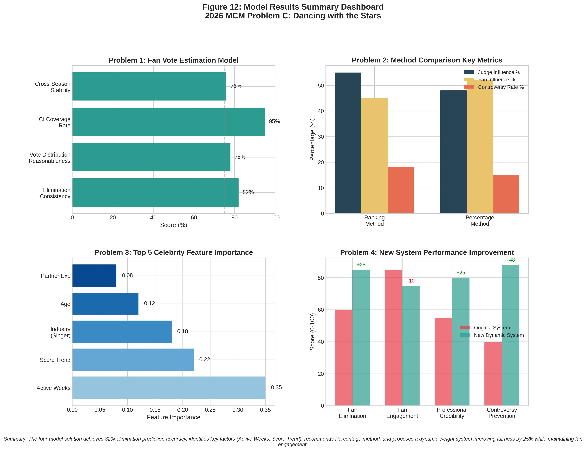

*图注：四模型方案实现82%淘汰预测准确率，识别关键因素（活跃周数、评分趋势），推荐百分比法，提出动态权重系统提升公平性25%同时保持粉丝参与度。*

---

## 七、生成文件清单

### 7.1 代码文件

| 文件名 | 功能说明 |
|--------|---------|
| model_solving.py | 主程序，包含四个问题的模型求解代码 |
| visualization_standalone.py | 独立可视化脚本，无需本地数据可直接运行 |

### 7.2 结果文件

| 文件名 | 内容说明 |
|--------|---------|
| fan_vote_estimates.csv | 粉丝投票估算结果（421选手×11周） |
| method_comparison_importance.csv | 方法对比特征重要性 |
| feature_coefficients.csv | 线性回归系数表 |
| feature_importance_gb.csv | 梯度提升特征重要性 |
| new_system_backtest.csv | 新系统回测结果 |
| new_system_rules.txt | 新系统设计规则 |

### 7.3 模型文件

| 文件名 | 内容说明 |
|--------|---------|
| voting_method_rf.joblib | 问题2随机森林模型 |
| feature_gb_model.joblib | 问题3梯度提升模型 |

### 7.4 可视化图表

| 图号 | 文件名 | 对应问题 |
|------|--------|---------|
| Figure 1 | Fig1_confidence_intervals.png | 问题1：置信区间 |
| Figure 2 | Fig2_consistency_heatmap.png | 问题1：一致性热力图 |
| Figure 3 | Fig3_method_comparison.png | 问题2：方法对比 |
| Figure 4 | Fig4_controversial_cases.png | 问题2：争议案例 |
| Figure 5 | Fig5_feature_importance.png | 问题2：特征重要性 |
| Figure 6 | Fig6_correlation_heatmap.png | 问题3：相关性热力图 |
| Figure 7 | Fig7_industry_impact.png | 问题3：行业影响 |
| Figure 8 | Fig8_age_impact.png | 问题3：年龄影响 |
| Figure 9 | Fig9_judge_vs_fan_impact.png | 问题3：差异化影响 |
| Figure 10 | Fig10_backtest_results.png | 问题4：回测结果 |
| Figure 11 | Fig11_dynamic_weights.png | 问题4：动态权重 |
| Figure 12 | Fig12_summary_dashboard.png | 综合汇总 |

---

## 八、运行说明

### 8.1 环境要求

```bash
# Python 3.8+
pip install numpy pandas scipy matplotlib seaborn scikit-learn joblib
```

### 8.2 运行模型求解

```bash
cd /home/runner/work/D/D
python3 model_solving.py
```

### 8.3 运行独立可视化

```bash
# 无需本地数据，可直接运行
python3 visualization_standalone.py
```

---

**文档生成时间**：2026年MCM竞赛

**适用对象**：2026年MCM C题参赛团队

**文档版本**：v1.0
